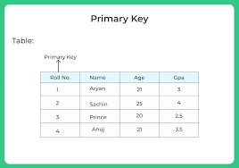
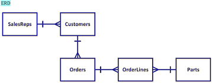
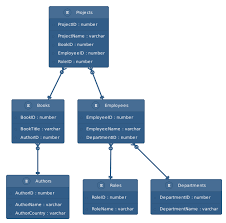

In this flipped class I have learned the important structured approach to build relational database and their importance.

### 1. Determining the purpose of designing database: 
* This approach/step ensure the needs of developing database.

### 2. Gather Data, Organize in tables and Specify the Primary Keys
* After collecting the data, its important to choose primary key.
* primary key ensure data integrity, consistency and efficient data ritrieval.
* Creation of relationships between tables.

### 3. Create Relationships among Tables
* relationship between table makes easier to understand the organization of data.

### 4. Refine & Normalize the Design
* essential for reducing redundancy.
* improving data integrity.
* make the database more flexible and efficient.

This is the basic steps that I have learned in this flipped class.

