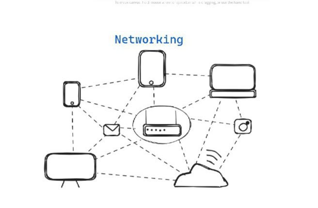
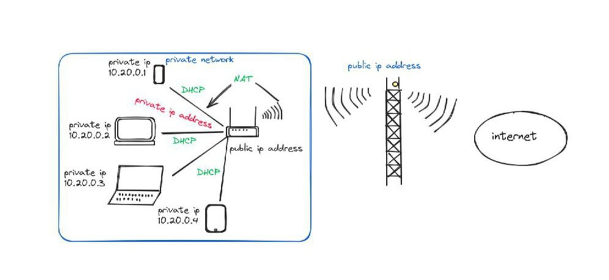

### Summary 

Internet? I didn't have any idea about internet before, I just knew that, to get resourses from google we have to be connected to internet and thought that I am getting access because I was paying for it(recharging data). In the past I didn't have those knowledge of networking, just knew how to connect/disconnect wifi/hotspot, but didn't know how they actually function in the field of cyber security. I didn't know that we were internally connected, when we are connected to one network. Wifi/hotspot were not just to connect/disconnect but it's just like a room where everybody will be in the room when they are connected to same network/wifi. 

Today's class was on the fundamental of networking, which was most important concept for introduction to cybersecurity. It was mainly focused on how computer communicate with eachother, what kind of medium does computer use for communication and their language. On top of that, there were many ways to connect computer to communicate. Reason of having different type of connection between computer is to maintain flexiblity to design with the organization needs interms of performance, cost, efficiency, etc. 

Most important concept that I learned from networking.

* NAT allows single ip address to represent all the machine that are connected to private network. 
* DHCP: It assign ip address to the devices when it is connected to a network. So that whatever we want from the internet can be specifically send to us because of ip address. And it's the solution for the sortage of ip address in the world.
* Ip address that is visible on the internet is our public ip address(which is shown in diagram above).
* And the ip address that we get by connecting to a network is called private ip address which is given by network router(just an example) with the help of DHCP.

 After attending this class I had more knowledge on networking and it's improtance to kwow those fundamentals.