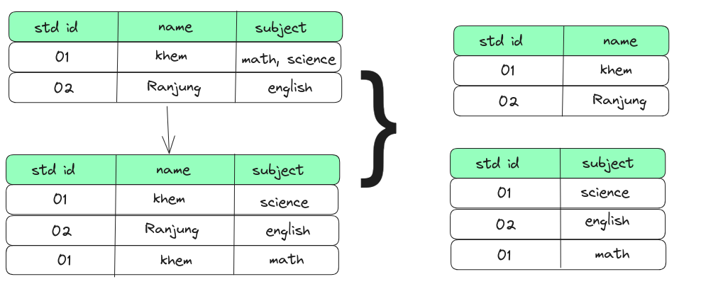

### First Normal Form

* Every column of a table should contain only atomic values.
* Table should not contain repeating columns 
* There are no composite or multi-valued attributes.
* Value stored in column should in same domain.

### Second Normal Form

* Should be in the First Normal form.
* Should not have Partial Dependency(every columnm should be depend on the entire primary key and not on a part of it)
 

### Third Normal Form

* It satisfies the First Normal Form and the Second Normal form.
* It should not have Transitive Dependency.

Transitive Dependency is the indirect relatioinship between primary key any other attribute.

Table with transitive dependency.

Table without transitive dependency.

###  Boyce-Codd Normal Form (BCNF)

* It is higher version of third nornal form.
* Every column should have relation with primary key or super key.

 In this table dept_name is not directly related to std_id which is primary key, rather it is be related to email_i.
 

### Fourth Normal Form (4NF)

* It should satisfies boyce-codd normal form.
* It should not have multi-valued Dependency.

---

In this flipped class we were divided into four group and assigned with each topic. After discussing assigned topic, each member from a group present their topic.

---

Fliped class would be efficient if we try different thing to present our lesson to the class
