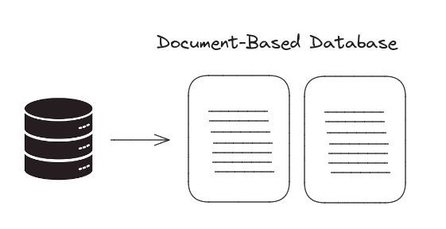
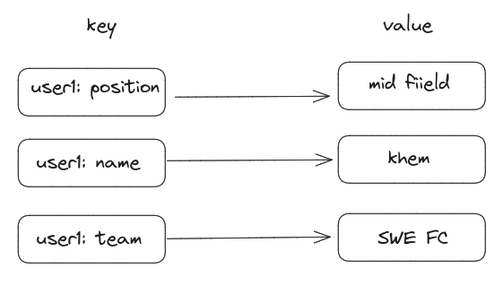
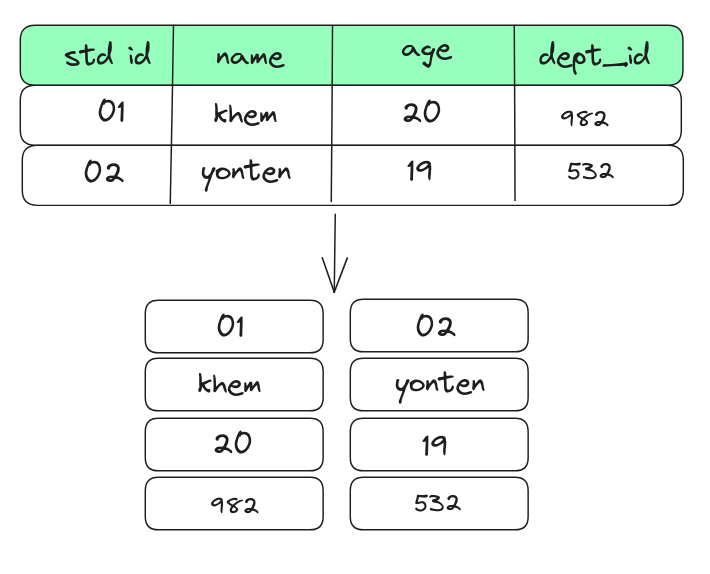
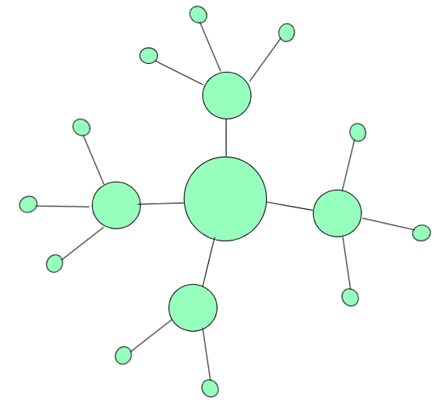
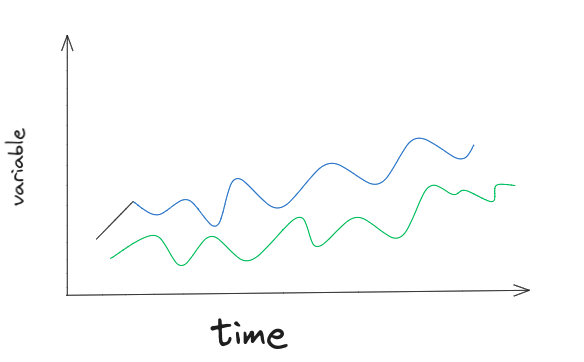
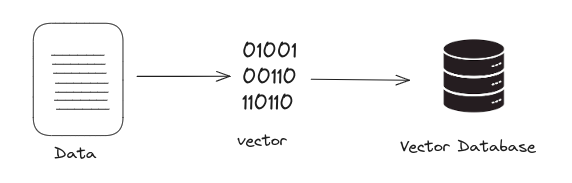

## Types of NoSQL Databases

NoSQL database  is non-relational database that is used to store data in nontabular form.

### Document-Based Database

* A document database stores data in JSON, BSON, or XML documents.
* Does not require a fixed schema.
* It is suitable for large amount of unstructured data.
* NO relation between two document.
* it is build with the use of XML, JSON, etc

### Key-Value Stores

* It is the simplest form of NOSQL.
* It is in the form of key and value pair.
* The data type of value can be any datatype.
* Fast to retrive data.

### Column Oriented Databases

* It stores the data instaeds of column.
* it is designed to read the data efficiently and retrive data.
* Used to store large amount of data.

### Graph-Based databases

* It stores the data in the form of nodes and connection between nodes is called link.
* It is easy to identity relationship between the data with the help of link.
* Graph-Based databases is designed to efficiently manage data that is highly interconnected.
* It is used in social networking.

### Time-series Databases

* Time-series database is designed to efficiently store and manage data that change overtime.
* Each data is organized by time, which helps in understanding how data are changed overtime.
* It is useful in scenarios where real-time data analysis is needed like tracking stock prices.

### Vector Databases

* It is designed to efficiently store high-dimensional vector data, which are mathematical represetation of data points.
* Vector database is used in various field such as machine learning.

---

In this flipped class we were divided into expert group and home group. In expert group we were assigned one topic where we had to discuss on assigned topic. After discussion in the expert group we were sent to home group to share what we have learned. There were six different topic and it was difficult to capture the points at short duration.

---

Flipped class would be easier if there is less do discuss, so that we can learn capture the concept clearly.

