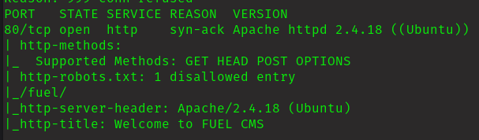
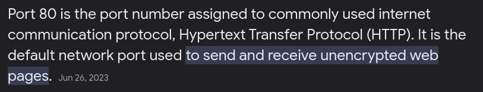
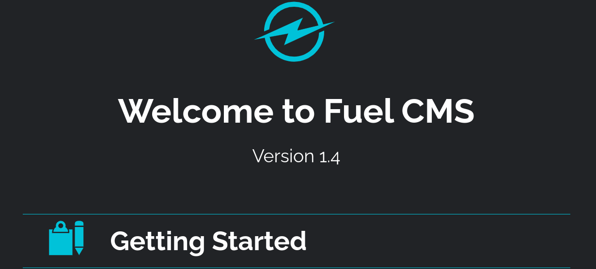
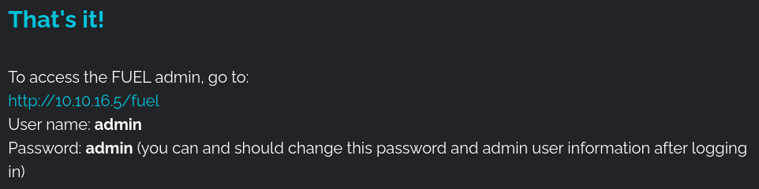
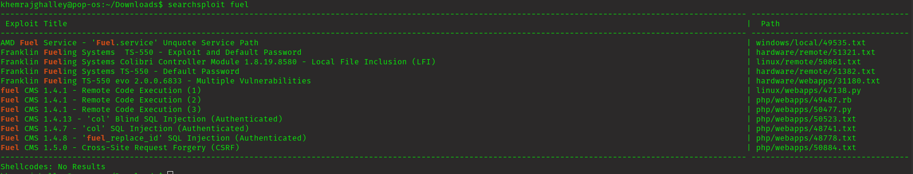
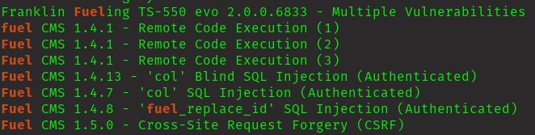

## Executive Summary

## Penetration Test Report
Target: 10.10.51.128

## Information Gathering Phase

Port Scanning with Nmap:

        nmap -sV -sC -vv 10.10.51.128

* port 80 is open.

* machine is running Apache HTTP Server version 2.4.18 on Ubuntu.
* Fuel CMS version 1.4.1 is running on the server.
*  a disallowed entry in the robots.txt file for the path /fuel/.

This is web page for given ip address.

got extra imformation.

we can perform Remote Code Execution.

Lets try RCE which is given above "php/webapps/50477.py"

