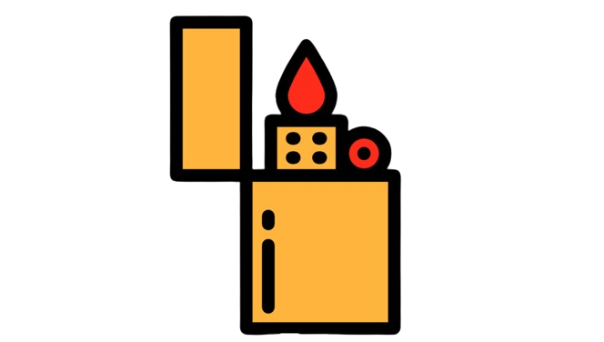
## Executive Summary

## Penetration Test Report
Target: 10.10.51.128

## Information Gathering Phase

Port Scanning with Nmap:

        nmap -sV -sC -vv 10.10.51.128

* port 80 is open.

* machine is running Apache HTTP Server version 2.4.18 on Ubuntu.
* Fuel CMS version 1.4.1 is running on the server.
*  a disallowed entry in the robots.txt file for the path /fuel/.

This is web page for given ip address.

When I sneak around the website I found username and password to login. 

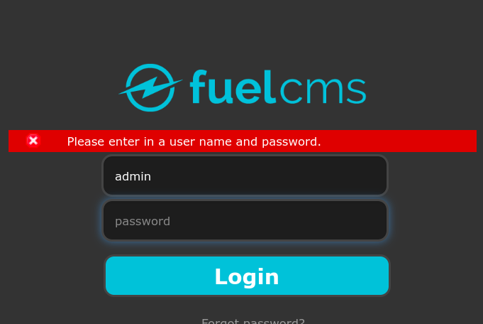

After logging in, this is what I got.
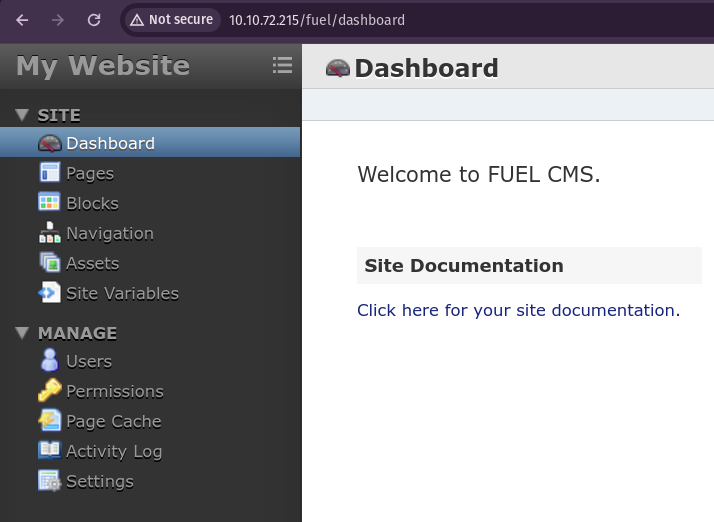

when I search more about it I found it's vulnerablities.
we can perform Remote Code Execution.

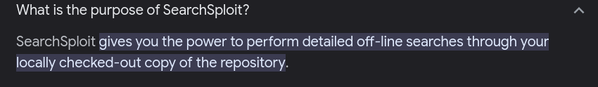

Got more information...

First download the script and lets try RCE. 
Got a shell and found the flag
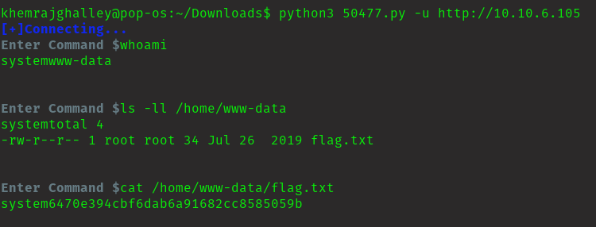

### Privilage Escalation

Lets try to get root account

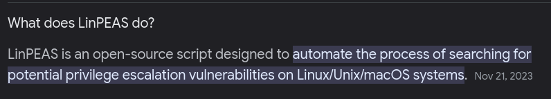

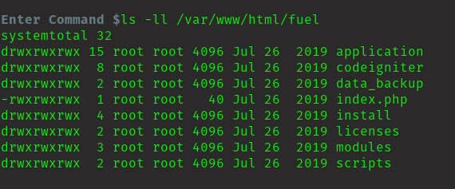

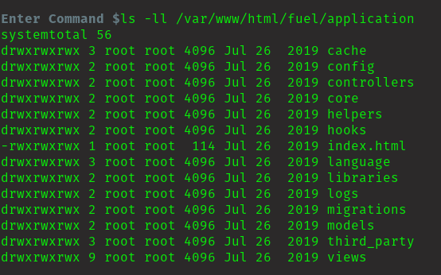

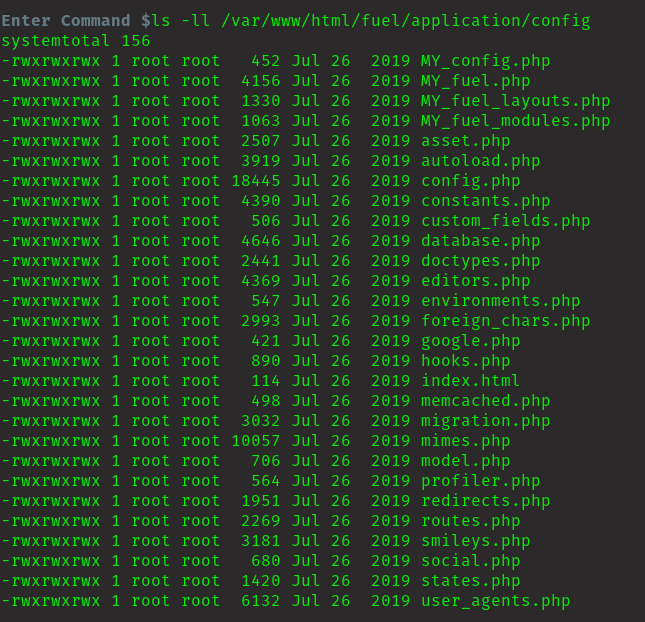

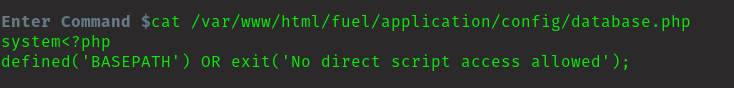

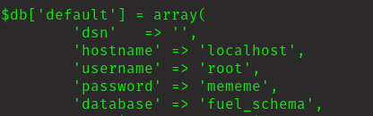

I got the root password.
Now, to access the root I have to get a reverse shell to retrive the flag. 

