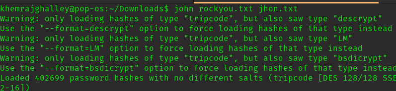
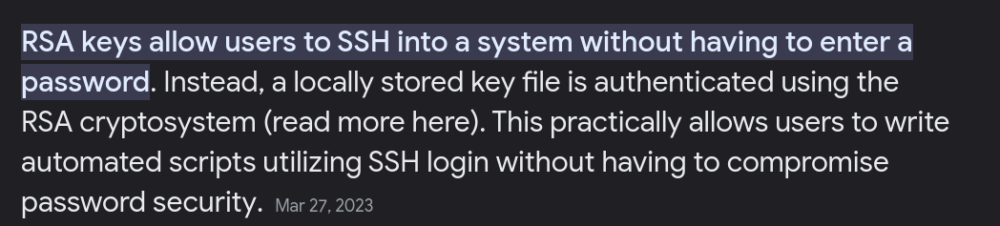
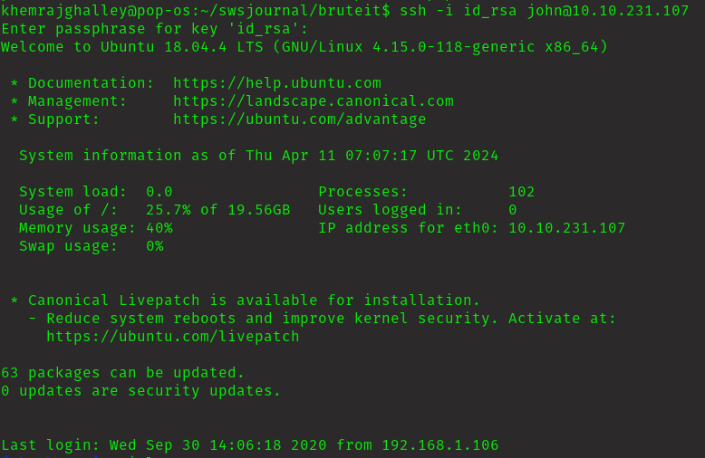
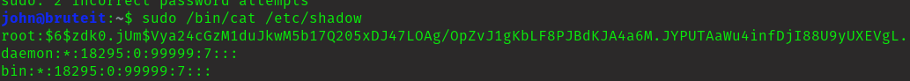
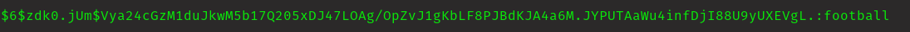
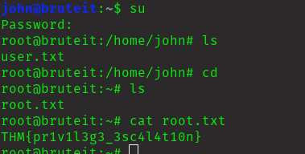

### Executive Summary

This pepetration test was held on the tryhackme machine "Brute it" with the primary objective of escalating privilege and retrieving user.txt and root.txt.   

### Information Gathering Phase

Target: 10.10.155.162

Nmap Scan:

    nmap -sC -sV -Pn 10.10.155.162

this is what is got

Lets see the hidden dir

Navigate to /admin

I don't have any clue what what are username and password.

let's break it using hydra

ohh user name is "admin"

Got password for admin!!!

finally I got the solution to crack the hash.

 go to this [link](https://www.onlinehashcrack.com/tools-private-key-ssh-rsa-dsa-openssh-hash-extractor.php) and convert rsa_id to hash.

    $ john rockyou.txt <name of file which has hash.txt>

   

Though I got the solution but due to poor condition of my laptop I could not crack the hash.

lets Go...

### Enumeration Phase

I was able to login successfully.

Now find user.txt

### Privilege Escalation

I got the hash for root user.

let's crack it!!!

### Final Thought

It is  interestinig room for begineer, it let us to use new tools like hydra which has unique and it was easy to use. It also introduce to new tool 'john', which I never heard about it.

