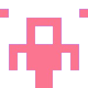

Nmap Scan:

    nmap -sC -sV -Pn 10.10.155.162

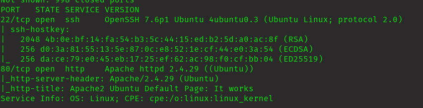

    PORT   STATE SERVICE VERSION
    22/tcp open  ssh     OpenSSH 7.6p1 Ubuntu 4ubuntu0.3 (Ubuntu Linux; protocol 2.0)
    | ssh-hostkey: 
    |   2048 4b:0e:bf:14:fa:54:b3:5c:44:15:ed:b2:5d:a0:ac:8f (RSA)
    |   256 d0:3a:81:55:13:5e:87:0c:e8:52:1e:cf:44:e0:3a:54 (ECDSA)
    |_  256 da:ce:79:e0:45:eb:17:25:ef:62:ac:98:f0:cf:bb:04 (ED25519)
    80/tcp open  http    Apache httpd 2.4.29 ((Ubuntu))
    |_http-server-header: Apache/2.4.29 (Ubuntu)
    |_http-title: Apache2 Ubuntu Default Page: It works
    Service Info: OS: Linux; CPE: cpe:/o:linux:linux_kernel

this is what is got
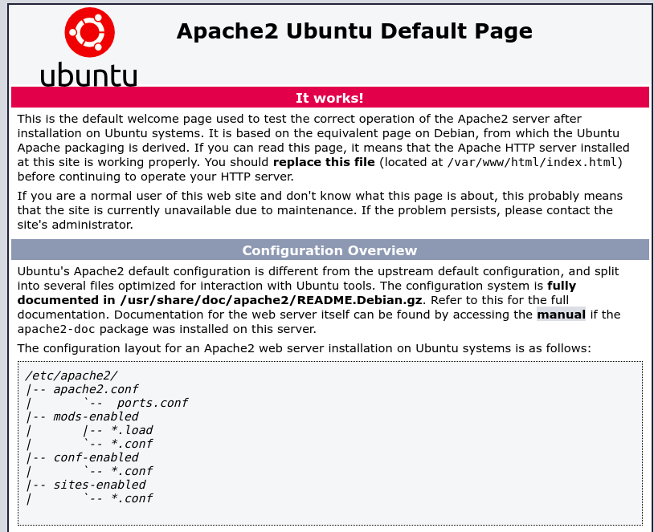

Lets see the hidden dir

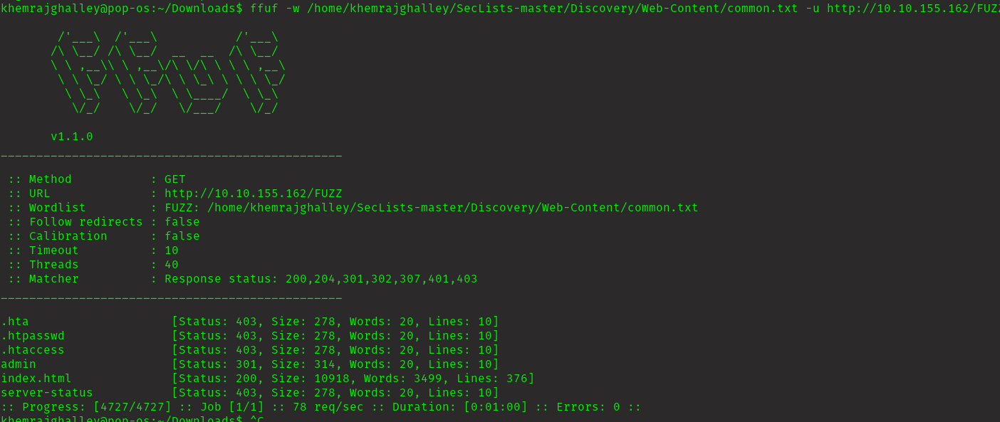

Navigate to /admin

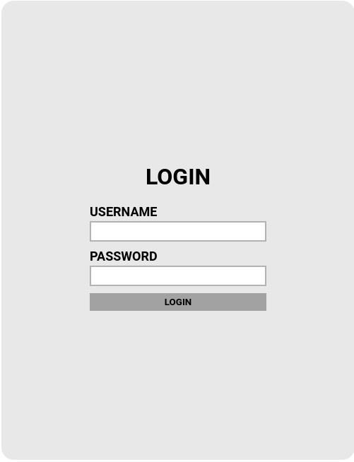

I don't have any clue what what are username and password.

let's break it using hydra

user name is "admin"
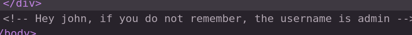

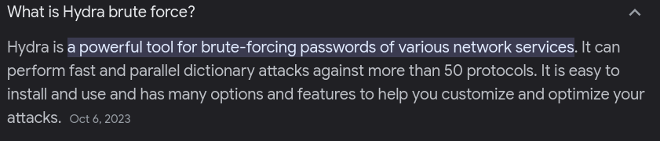

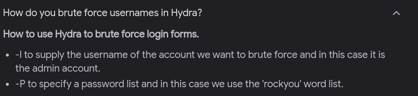

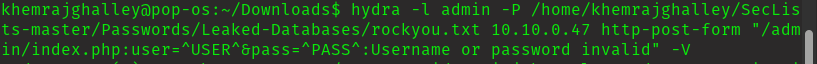

Got password for admin!!!
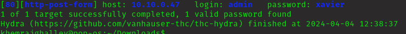

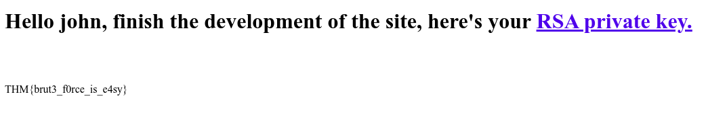

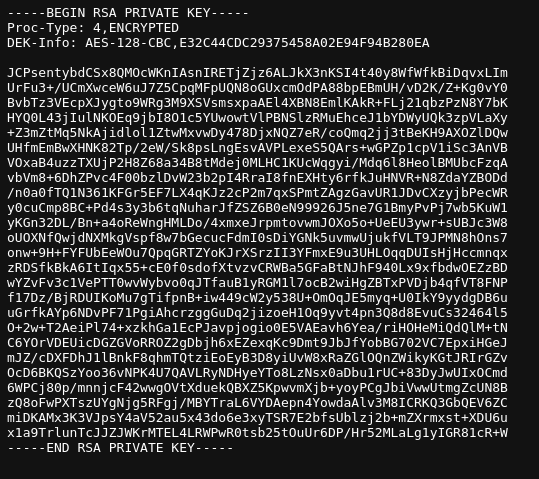

Work in progress

