## Penetration Test Report

Target: 10.10.125.125

### Information Gathering Phase

Port Scanning with Nmap:

    nmap -sV -vv -sC 10.10.125.125

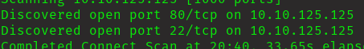

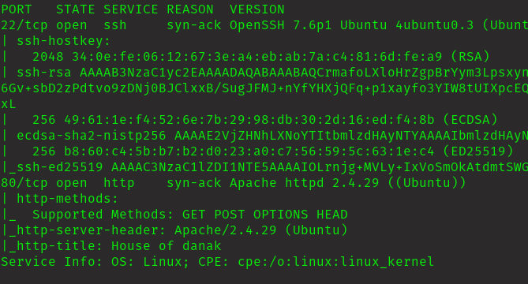

Discovered 2 ports open.

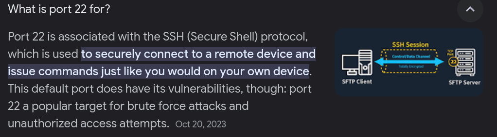

Lets go for port 80.

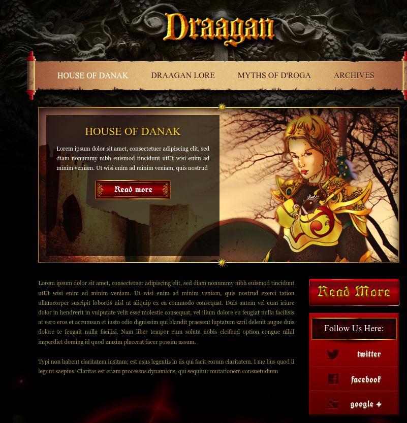

This is what I got on wepage. Lets sneak out some information from here.

assets/gameserver/gameserverusername.png

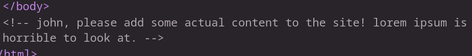

Haha! I guess this is the username. I couldn't find any important information here. Lets try to brute force the hidden directories.

For brute forcing, am gonna use ffuf. 

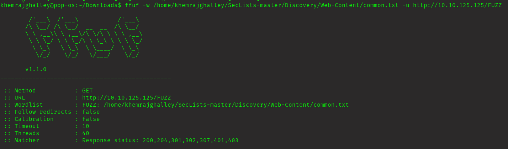

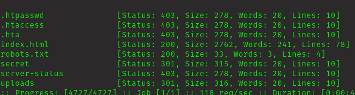

Those are the hidden directories. Lets check one by one. First of all lets go for secret because its seems somthing is there.

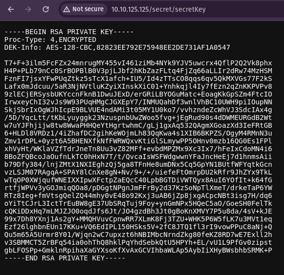

This is second time I am dealing with rsa private key.

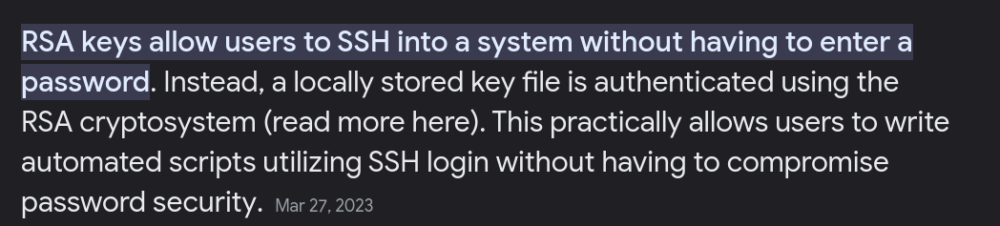

Now I have to crack the rsa key to get the password. Lets do this!!!

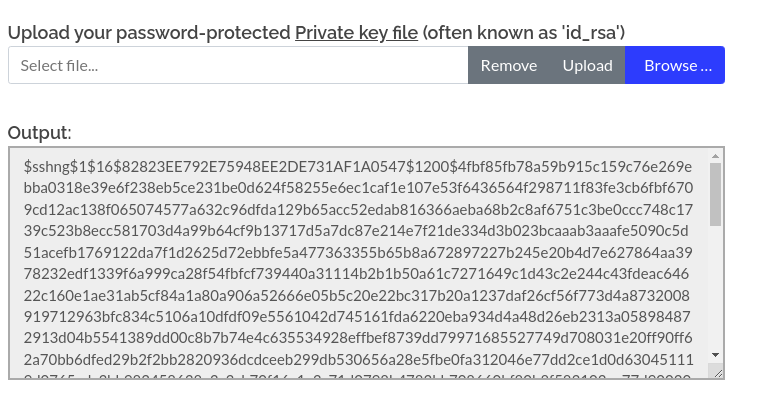

I got the hash for rsa key.

Lets crack it!!

assets/gameserver/gameserverhachcrasked.png

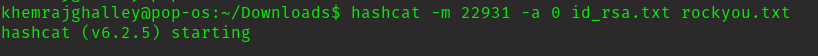

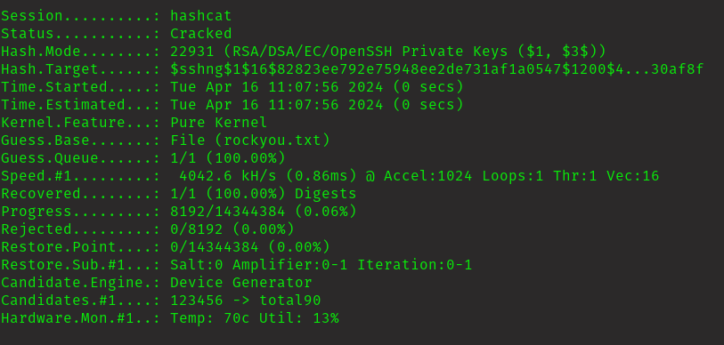

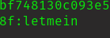

Now I have both password and username. Lets login to ssh.

