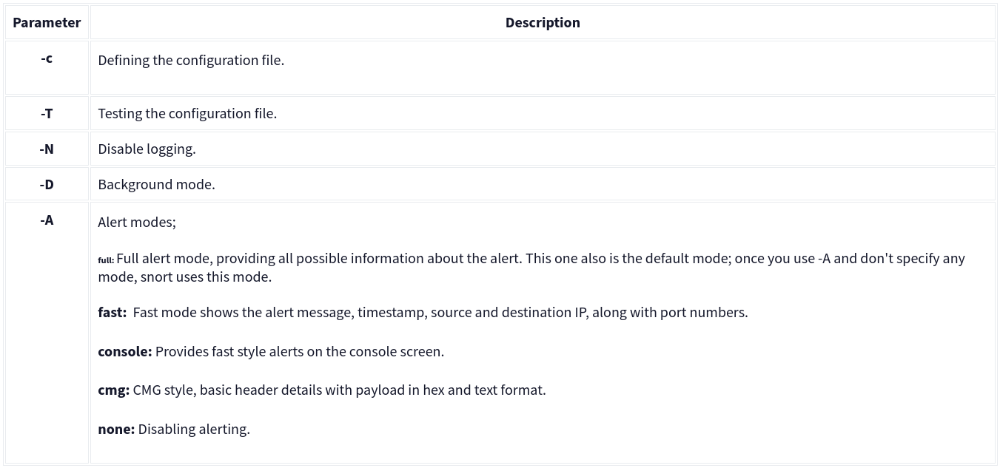
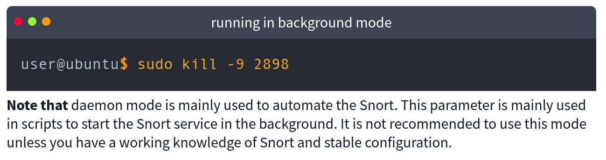
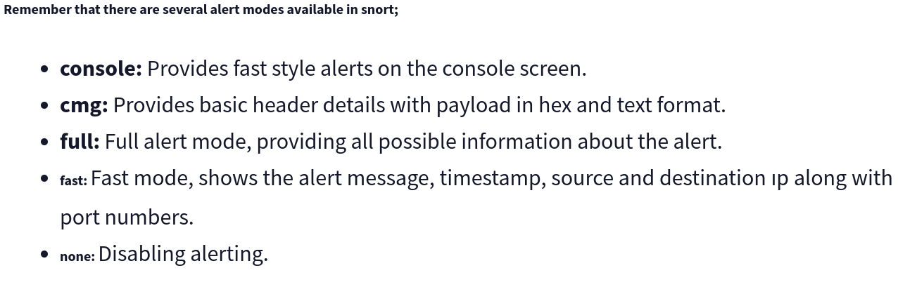
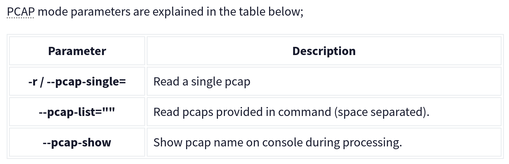

# Introduction to IDS/IPS

## Intrusion Detection System (IDS)

Intrusion Detection System (IDS) is monitoring system that detects the malicious activities and genertes alerts when it detects any malicious activities.

### There are two main types of IDS systems;

1. Network Intrusion Detection System (NIDS)

* Monitors the traffic flow from various devices on the network. Create alerts when it detects any malicious activities.

2. Host-based Intrusion Detection System (HIDS)

* it monitors the traffic flow from a single endpoint device. 

## Intrusion Prevention System (IPS)

Intrunsion Prevention System is a network security tool that continuously monitor the network for malicious activity to prevent it. It is responsible for terminating the suspicious event as soon as dectection is performed.

 There are four main types of IPS systems;

1. Network Intrusion Prevention System (NIPS)

2. Behaviour-based Intrusion Prevention System (Network Behaviour Analysis - NBA)

NBA enhance the network safety by monitoring network traffic and observing unusual activities and depature of network. 

It is similar to NIPS but NBA needs traning to know normal and detect abnormal traffic.

3. Wireless Intrusion Prevention System (WIPS)

WIPS monitors the traffic flow from wireless notwork. It's aim is to protect the wireless traffic and stop possible attacks

4. Host-based Intrusion Prevention System (HIPS)

The difference between them is that while HIDS creates alerts for threats, HIPS stops the threats by terminating the connection.

## Detection/Prevention Techniques

There are three main detection and prevention techniques used in IDS and IPS solutions;

Summary 

## Introduction to Snort

Snort is an open-source network intrusion detection and prevention system (IDS/IPS). 

## Operation Mode 1: Sniffer Mode

Let's run Snort in Sniffer Mode

## Operation Mode 2: Packet Logger Mode

### Logfile Ownership

To investigate the log file, we need superuser(root). 

There are two different approaches to investigate the generated log files;

1. use sudo su command to switch to root user.

1. Change ownership of the file.

### Logging with parameter "-l"

    sudo snort -dev -l .

It allows to configure the default output directory in snort.config file.

### Logging with parameter "-K ASCII"

    sudo snort -dev -K ASCII

## Operation Mode 3: IDS/IPS

### Snort in IDS/IPS Mode

Let's run Snort in IDS/IPS Mode

### IDS/IPS mode with parameter "-c and -T"

    IDS/IPS mode with parameter "-c and -T"

This command will check configuration file and prompt it if there is any misconfiguratioın in your current setting.

### IDS/IPS mode with parameter "-N"

    sudo snort -c /etc/snort/snort.conf -N

The command-line output will provide the information requested with the parameters.

### IDS/IPS mode with parameter "-D"

    sudo snort -c /etc/snort/snort.conf -D

### IDS/IPS mode with parameter "-A"

Only the "console" and "cmg" parameters provide alert information in the console. So its diffcult to identify the difference between the alerts through terminal. Differences can be identified by looking at generated logs. 

### IDS/IPS mode with parameter "-A console"

    sudo snort -c /etc/snort/snort.conf -A console

Snort generates alerts based on network traffic analyzed against its rules. which helps to identify the threads and attacks on the network.

### IDS/IPS mode with parameter "-A cmg"

    sudo snort -c /etc/snort/snort.conf -A cmg

This mode is useful for detailed analysis and troubleshooting.

### IDS/IPS mode with parameter "-A fast"

    sudo snort -c /etc/snort/snort.conf -A fast

This mode is efficient for monitoring and quickly identifying potential threats based on the provided ruleset.

### IDS/IPS mode with parameter "-A full"

    sudo snort -c /etc/snort/snort.conf -A full

This mode is useful for detailed analysis and providing a detail understanding of threads found.

### IDS/IPS mode with parameter "-A none"

    sudo snort -c /etc/snort/snort.conf -A full

This mode is useful for monitoring without generating alerts, focusing on logging traffic for analysis later.

### IDS/IPS mode with parameter "-A none"

    sudo snort -c /etc/snort/snort.conf -A none

 This mode  parameter turns off alert generation but continues logging traffic in binary format. It monitors the traffics without alerts.

### IDS/IPS mode: "Using rule file without configuration file"

Running the Snort in this mode will help you test the user-created rules. However, this mode will provide less performance.

### IPS mode and dropping packets

This mode allows it to drop packets based on predefined rules, requiring at least two network interfaces (-i eth0:eth1). This mode is efficient for monitoring and quickly identifying potential threats.

## Operation Mode 4: PCAP Investigation

### Let's investigate PCAPs with Snort

Snort's capabilities is not limited to sniffing and logging; it can also read and analyze PCAP files to provide insights and alerts based on your ruleset, enhancing the investigation process.

### Investigating single PCAP with parameter "-r"

    sudo snort -c /etc/snort/snort.conf -q -r icmp-test.pcap -A console -n 10

This command is used to analyze PCAP file.

### Investigating multiple PCAPs with parameter "--pcap-list"

    sudo snort -c /etc/snort/snort.conf -q --pcap-list="icmp-test.pcap http2.pcap" -A console --pcap-show

This command is used to analyze multiple PCAP files.

# Snort Rule Structure

## Snort Rule Structure