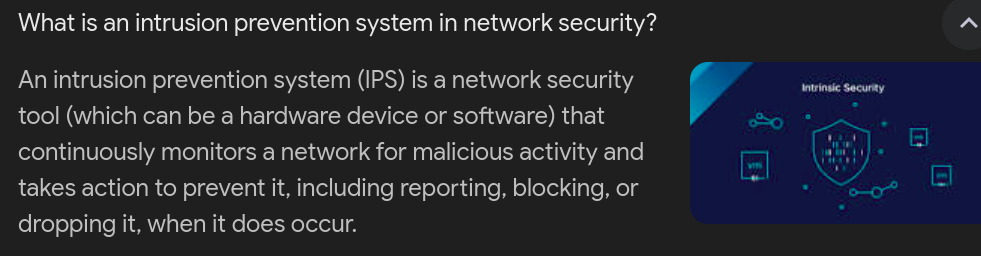
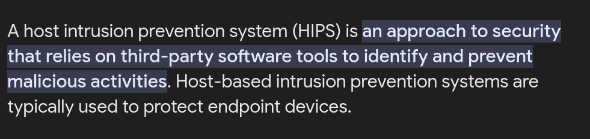
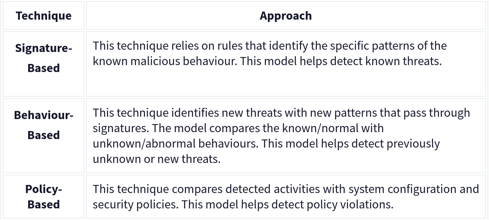
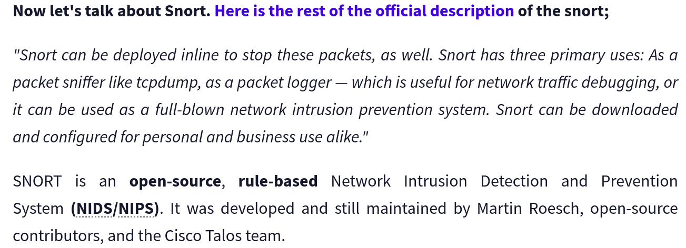
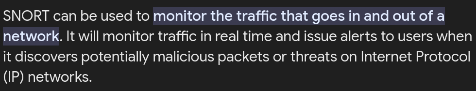
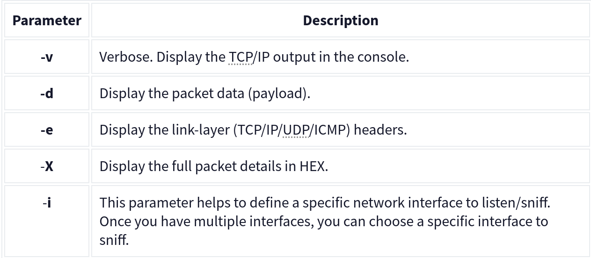
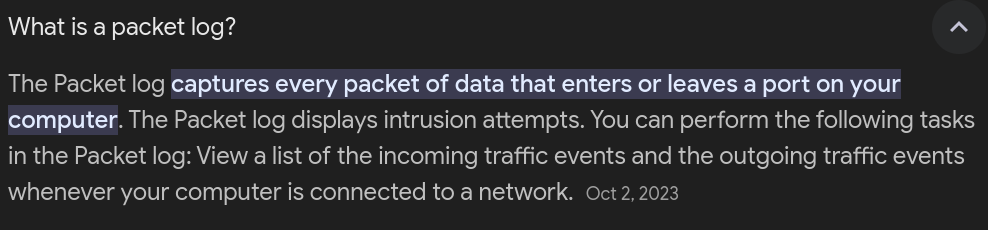
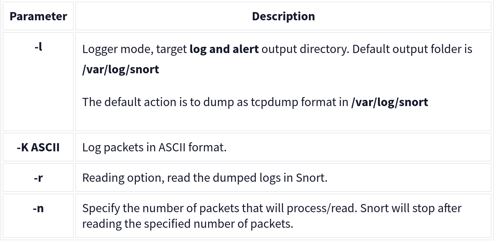

# Introduction to IDS/IPS

## Intrusion Detection System (IDS)

Intrusion Detection System (IDS) is monitoring system that detects the malicious activities and genertes alerts when it detects any malicious activities.

### There are two main types of IDS systems;

1. Network Intrusion Detection System (NIDS)

* Monitors the traffic flow from various devices on the network. Create alerts when it detects any malicious activities.

2. Host-based Intrusion Detection System (HIDS)

* it monitors the traffic flow from a single endpoint device. 

## Intrusion Prevention System (IPS)

Intrunsion Prevention System is a network security tool that continuously monitor the network for malicious activity to prevent it. It is responsible for terminating the suspicious event as soon as dectection is performed.

 There are four main types of IPS systems;

1. Network Intrusion Prevention System (NIPS)

2. Behaviour-based Intrusion Prevention System (Network Behaviour Analysis - NBA)

NBA enhance the network safety by monitoring network traffic and observing unusual activities and depature of network. 

It is similar to NIPS but NBA needs traning to know normal and detect abnormal traffic.

3. Wireless Intrusion Prevention System (WIPS)

WIPS monitors the traffic flow from wireless notwork. It's aim is to protect the wireless traffic and stop possible attacks

4. Host-based Intrusion Prevention System (HIPS)

The difference between them is that while HIDS creates alerts for threats, HIPS stops the threats by terminating the connection.

## Detection/Prevention Techniques

There are three main detection and prevention techniques used in IDS and IPS solutions;

Summary 

## Introduction to Snort

Snort is an open-source network intrusion detection and prevention system (IDS/IPS). 

## Operation Mode 1: Sniffer Mode

Let's run Snort in Sniffer Mode

## Operation Mode 2: Packet Logger Mode

