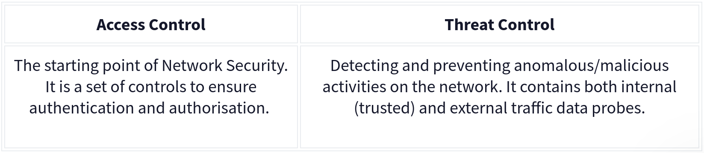

# Introduction

Network Security is about understanding the traffic that flows through the network. It includes the analysis of the traffic to identify the threats and vulnerablities. Mainly focusing on keeping data and application safe that are connected to netwok.

# Network Security and Network Data

### photo

## Network Security

Network Security is about making sure that only the right people can access the right data. It is about keeping the data safe from unauthorized access, modification, and destruction. It is about making sure that the data is available to right people.

Implementation of network security uses two main concepts that are authentication and authorization.

### Base Network Security Control Levels:

Physical | physical security control prevent unauthorized access to the network devices.

Technical | Data security control prevent unauthorised access to network data like installing malware into the system.

Adminstrative | Adminstrative security control prevent unauthorized access to the network by setting up the policies and procedures.

There are two main approaches and multiple elements under these control levels.

The key elements of Access Control:

Firewall Protection: Control incoming and outgoing traffics. Design to block malicious traffic.

Network Access Control (NAC): Before devices are allowed to connect to the network, they are checked to ensure they meet a certain category of network.

Identity and Access Management (IAM): It make sure that only the right people have access to the right data. 

Load Balancing: Handle the resources usage.

Network Segmentation: Splitting the network into different group.

Virtual Private Networks (VPN): Creates and controls encrypted communication between devices over the network.

Zero Trust Model: Configure before giving access.  "Never trust, always verify".

The key elements of Threat Control:

Intrusion Detection and Prevention (IDS/IPS)

