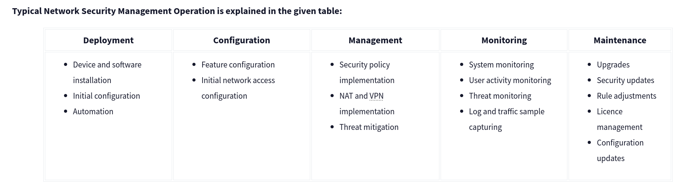

# Introduction

Network Security is about understanding the traffic that flows through the network. It includes the analysis of the traffic to identify the threats and vulnerablities. Mainly focusing on keeping data and application safe that are connected to netwok.

# Network Security and Network Data

### photo

## Network Security

Network Security is about making sure that only the right people can access the right data. It is about keeping the data safe from unauthorized access, modification, and destruction. It is about making sure that the data is available to right people.

Implementation of network security uses two main concepts that are authentication and authorization.

### Base Network Security Control Levels:

Physical: physical security control prevent 

Adminstrative: Adminstrative security control prevent unauthorized access to the network by setting up the policies and procedures.

There are two main approaches and multiple elements under these control levels.

The key elements of Access Control:

Firewall Protection: Control incoming and outgoing traffics. Design to block malicious traffic.

Network Access Control (NAC): Before devices are allowed to connect to the network, they are checked to ensure they meet a certain category of network.

Identity and Access Management (IAM): It make sure that only the right people have access to the right data. 

Load Balancing: Handle the resources usage.

Network Segmentation: Splitting the network into different group.

Virtual Private Networks (VPN): Creates and controls encrypted communication between devices over the network.

Zero Trust Model: Configure before giving access.  "Never trust, always verify".

### The key elements of Threat Control:

Intrusion Detection and Prevention (IDS/IPS): It monitors the traffic and identifies threads.

Data Loss Prevention (DLP): It doesn't allow extraction of data.

Endpoint Protection: Protection of enpoints by encrypting the data.

Cloud Security: Protects online-based system from threads. 

Security Information and Event Management (SIEM): It helps in detecting the threads.

## Managed Security Services

It is aservice provider who have expertise in security and provide security services to the organization. It helps in reducing the cost of security and provide the expertise in security.

# Traffic Analysis

Traffic Analysis is being a detective to our computer. It is about understanding the traffic that flows through the network. It includes the analysis of the traffic to identify the threats and vulnerablities. Mainly focusing on keeping data and application safe that are connected to netwok.

## There are two main techniques used in Traffic Analysis:

### Flow Analysis	
It collects data from the networking devices and analyze the data.
 
* Advantage: Easy to collect and analyse.
* Challenge: Doesn't provide full packet details to get the root cause of a case.

### Packet Analysis

Collects the full packet data and analyze the data. Investigate the packet-level in depth to detect and block anomalous and malicious packets.

* Advantage: Provides full packet details to get the root cause of a case.

* Challenge: Requires time and skillset to analyse.

### Benefits of the Traffic Analysis:

* Provides full network visibility.
* Helps comprehensive baselining for asset tracking.
* Helps to detect/respond to anomalies and threats.

## Does the Traffic Analysis Still Matter?

The widespread usage of security tools/services and an increasing shift to cloud computing means that hacker are constantly finding new ways to attack the network and stay undecected. Even if the data is encrypted, data can be used to detect the threats from unexpected pattern. Therefore  traffic analysis is still a must-to-have skill for security analysts.

