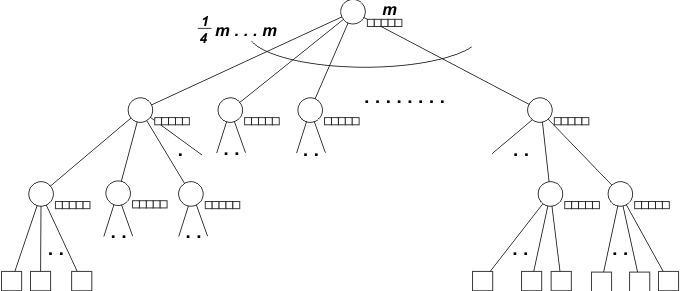

# Indexing 

Indexes are special tools in databases that make finding things faster. 

This flipped class was the most interesting flipped class I have ever experience till now though some of the concept was not clear to me. The way of dividing group was fun and interesting. The topic was on indexing. Indexing is a way to sort a number of records on multiple fields. Creating an index on a field in a table creates another data structure which holds the field value, and pointer to the record it relates to. This index structure is then sorted, allowing Binary Searches to be performed on it. After the group discussion, we had quiz on the topic that we have discussed. While having quiz I was not able to answer some of the question. I need to go through the topic again to understand it properly. At the point of answering the question the feeling was so different thinking that we will lose points if we don't answer correctly.

1. Buffer Tree

Buffer Tree is mainly for storing large data efficiently such as audio or video file.

* Regulating data flow between devices
* Allowing the sender to transmit data at a faster rate
* Preventing lost data due to network congestion

2. Bitmap Indexing

Bitmap Indexing is a data structure used mainly for better query performance. It is used to quickly find the rows in a table that match a particular value. It is a special kind of index that stores the bulk of the data in a bitmap.

Advantages of Bitmap Indexing
* Efficiency in terms of insertion deletion and updation.
* Faster retrieval of records.
* Space efficiency: Bitmap indexing is more space-efficient especially when dealig with columns with a small number of unique values.

Applications of Bitmap Indexing in DBMS
* Fast queries on large datasets: Bitmap indexing is particularly useful for fast queries on large datasets.

* Efficient range queries: Bitmap indexing can also be used for efficient range queries on numeric or date columns.

Indexing of Spatial and Temporal Data

Indexing of spatial and temporal data refers to the process of organizing and structuring data in a way that allows for efficient querying and analysis based on both location (spatial) and time (temporal) attributes. This type of indexing is commonly used in geographic information systems (GIS) and other applications that involve spatial and temporal data.

Indexing of Spatial Data

* Organizes and locates items based on their position in space.
* Allows for efficient retrieval of data based on spatial relationships.
* Useful for identifying nearby places, like finding all eateries within a specific radius from a spot.

Indexing of Temporal Data

* Mainly used for organizing data that changes over time such as daily temperature, stock prices, etc.
* Helps in retrieval of data based on the timing of events.
* Helps in analyzing trends and patterns over time.

---

When we do different activities in flipped class, it makes us more interactive and we can learn more. I hope we will have more flipped class like this in future.