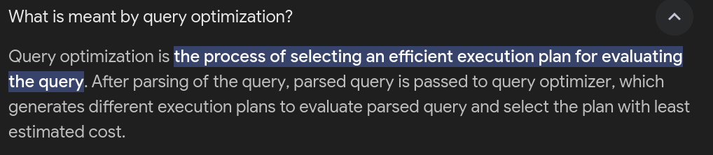
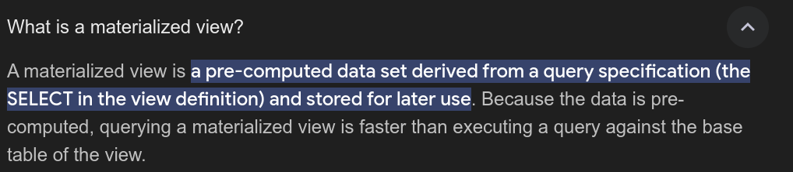
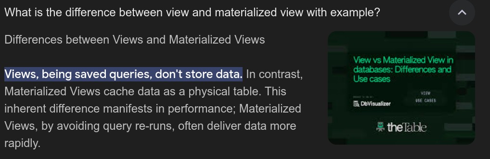

For this flipped class were divided into four group with six member in each group. There were two different topics and two group were assigned same topic to discuss. Our topic was on "Advanced Query Optimization Techniques" and other one was "Materialised Views". After discussing we were divided into two group with different topic and had a quiz. 

## Advanced Query Optimization

1. Query Explainers: Query explainer tools help to understand how a database query works and how it can be improved. They show the steps a query takes to execute and suggest ways to make it faster.

2. Index Optimizations: Choosing the right type of index when creating them is crucial for speeding up searches in databases. This choice not only makes searching quicker but also reduces the time taken to scan the whole table and reduce usage of resources.

3. Batch Query: Running many queries together in one group helps save time and energy by doing fewer things like connecting to the database and asking for information. This way, it can get lots of jobs done at once, making everything run smoother and faster.

4. In-Memory Storage: Using in-memory databases can make reading data faster for queries that need quick answers. This is especially useful for storing the results of queries that are asked often, so they're ready quickly next time.

5. Data Denormalization: Data denormalization makes it easier to avoid complicated combinations of data and speeds up reading information. This is particularly beneficial for systems where reading data is done very often.

6. Bitmap Index Usage: Using bitmap indexes is great when we have fields that don't change much. It's really helpful for queries that need to sort through these fields quickly.

## Materialised Views

This is the second best flipped class done till now as we were able to discuss and understand the topic in a better way. We were able to understand the concept of materialised view and how it is different from view. We also had a quiz on the topic which was really helpful to understand the topic in a better way. 

