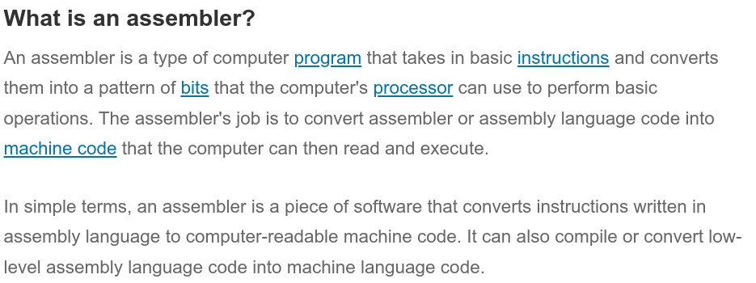
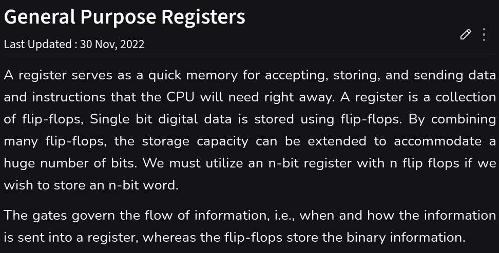
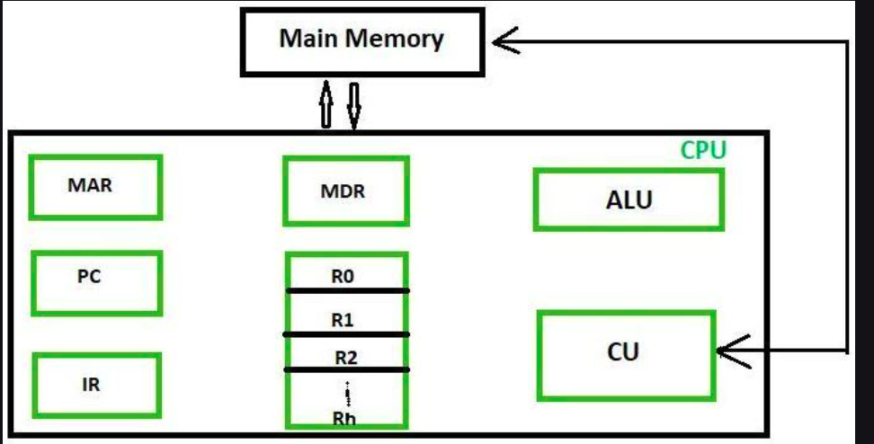

## Assembler

## Debugger

## Registers

### Working of Registers

When there is input from the user, it is stored in the registers. The registers are used to store the data temporarily. The data is then processed by the CPU. Result are drawn from the registers.

### Memory and Addresses

In the past, managing memory was complicated due to the limitations of early x86 processors. These processors had registers that could only hold 16 bits, limiting them to accessing up to 64 kilobytes of memory. 

