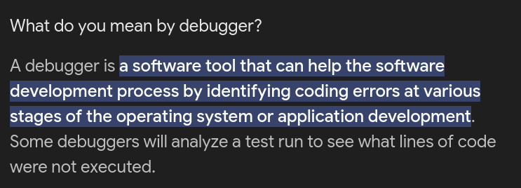

## Assembler

## Debugger

## Registers

### Working of Registers

When there is input from the user, it is stored in the registers. The registers are used to store the data temporarily. The data is then processed by the CPU. Result are drawn from the registers.

## Our First Program

Here's the code for our first program in x86-64 assembly:

    format PE64 NX GUI 6.0
    entry start

    section '.text' code readable executable
    start:
            int3
            ret

### Analyzing the Code
