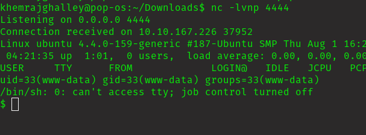

## Execute Summary

This pepetration test was held on the tryhackme machine "DAV" with the primary objective of retrieving user.txt and root.txt.   

Target: 10.10.167.226

## Information Gathering Phase

Discovered 1 ports open.

This is what I got on wepage. Lets sneak out some information from here.

Got one hidden directory. Lets check it out.

Lets find out the credentials for this.

I got the credentials. Lets login.

## Exploitation Phase

I tried to crack but I couldn't.

Lets find new way to exploit this.

Finally I found the exploit.

I used same credentials to login from the terminal, it worked.

I could upload the reverse shell file.

Successfully uploaded the reverse shell file.

Now lets stabilize the shell.

    python -c 'import pty; pty.spawn("/bin/bash")'

Let's sneak around to get the user flag.

Got the user flag.

## Privilege Escalation Phase

Lets find the privilege escalation vector.

 I can run cat as root without password. Lets do this.

 

Got the root flag.

## Final Thought

This was a fun machine. I learned about cadaver from this machine. I will try to do more machines like this. 

