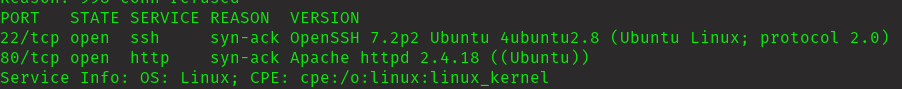
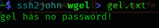

## Execute Summary

This pepetration test was held on the tryhackme machine "WGEL" with the primary objective of retrieving user.txt and root.txt.

Target: 10.10.84.92

## Information Gathering Phase

Discovered 2 ports open.

This is what I got on wepage. Lets sneak out some information from here.

I guess this is the username.

Got hidden directory. Lets check it out.

Got id_rsa file. Lets try to crack it.

Then its making my work easier. Lets try to login with ssh.

Remember username is jessie.

## Exploitation Phase

Logged in successfully. Lets get the user.txt.

Got the user.txt. Lets move on to root.txt.

