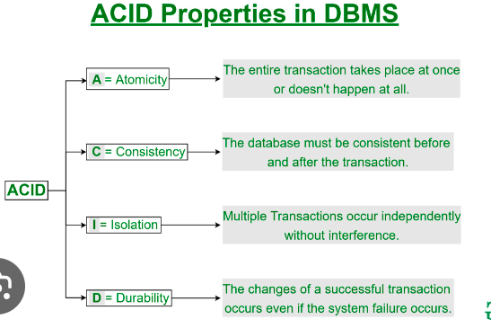
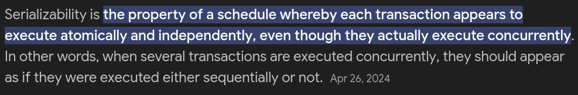
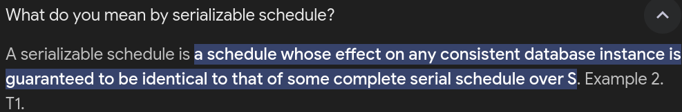
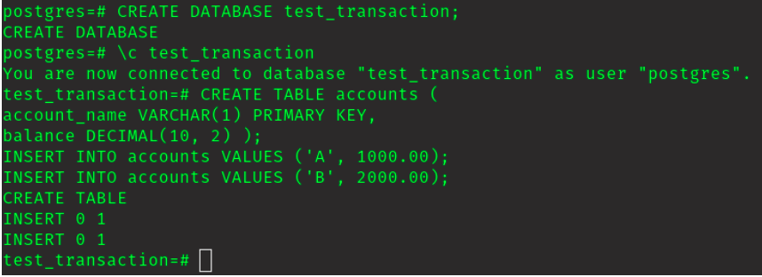
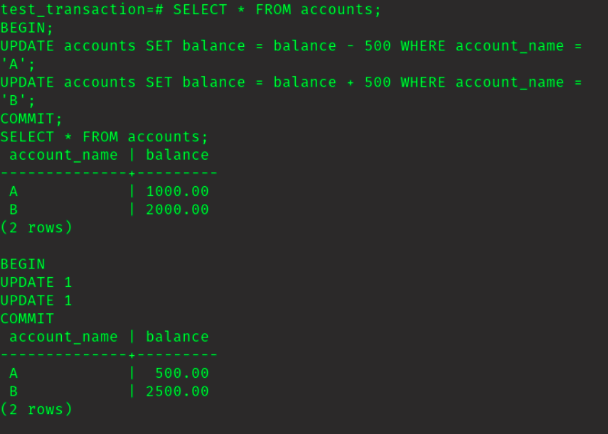
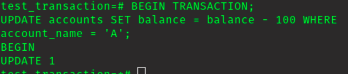
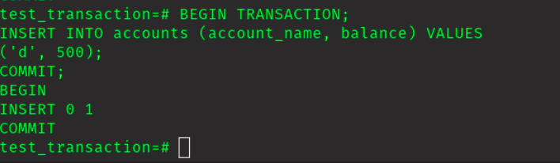
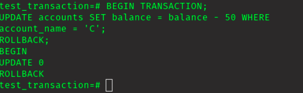

# Transactions

In this flipped class it was different from the normal flipped class that we used to have. It was a normal class on Transactions.

## Understanding Transactions in DBMS

In a Database Management System (DBMS), doing things like  adding, changing, or getting rid of data is called a transaction. This could mean inserting new info, taking away old info, or fixing existing info in the database.

## ACID Properties

## Serializability

### Schedules in DBMS are of types:

1. Serial Schedule: A schedule where only one transaction happens at a time, meaning one transaction finishes before another starts, is what we call a serial schedule.

2. Non-serial Schedule: A non-serial schedule is when transactions don't wait for each other to finish; they can happen all at once, kind of like having multiple people working on different tasks at the same time.

### What is serializable schedule?

### Types of Serializability

In DBMS, there are two kinds of serializability: conflict serializability and view serializability.

1. Conflict Serializability: This makes sure that whatever happens when transactions are running together looks just the same as if they were running one after the other, in some order.

2. View Serializability: This is about making sure that no matter what we execute, the database looks the same to everyone.

--- 

# Practical 

1. Database Initialization

* Create database.
* Create tables.
* Insert data.

2. Transaction for Balance Transfer

3. Updating Account Balance

4. Inserting and Committing Data

5. Handling Transaction Errors

Through this lession we learned how the transaction works.

