#  Executive Summary

###  Github Repo Link

[link to github repo](https://github.com/Khemraj9815/SWS101/tree/main/SWS/caps/cap2)

# Website Penetration Test Assessment Summary

## Pixi

## URL 1: 10.3.21.141:8000 

###  File upload vulnerabilities

File upload vulnerabilities occur when the server does not set boundaries/restrictions for file uploads. When server accepts whatever user uploads on the server, this can lead accepting malicious file which can function as web shell, granting attacker higher privileges.

Consequences

Attacker will be able to upload malicious file on the server which can lead to higher privileges. They can go further after successfully uploading the file. They can even get higher privileges as administrative access and they can do whatever they want.

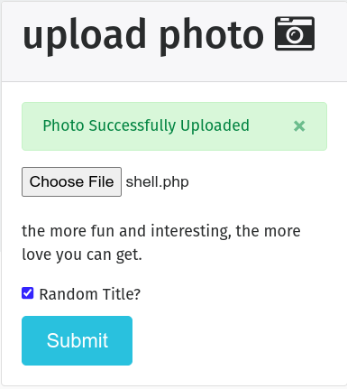

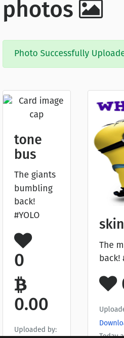

There is no validation of file that user upload on the server. So I could upload reverse shell file on the server. 

This vulnerablities can lead attacker gaining higher privileges. So its important to filter out all the input data from user. So that attacker will not be able to come close to the higher privilege.

Recommendation

What to do to prevent this vulnerablities is to filter out the input data from the user. The server should only accept the file that are meant to be uploaded.

# Gruyere(Cheese)

## URL 1: 10.3.21.141:8008

###  File upload vulnerabilities

The flle upload vulnerablities occur when web server allows user to upload files to its filesystem without validating the file extentions. This lack of validation can enable attacker to upload dangerous file that can function as web shell, granting them higher privileges. This works same as pixi that dose not filter the data that user upload. If the attacker is able to upload their malicious code the system atfirst step. Then they will find a way to execute the file. 

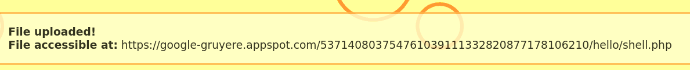

Here its okay that we are not able to access the file from the given url. But still it is dangerous because it does not filter input data.

Consequences

The consequence of being able upload malicious file can lead to compromising whole system, takeover file system or database, etc.      

Recommendation

To prevent this vulnerablities, the server should filter out the input data from the user. The server should only accept the file that are meant to be uploaded.

### Access Control

Its the boundary between user and the administrator where they are only allowed access with their level of privileges. This occurs when normal user are able to see which are not meant to see. 

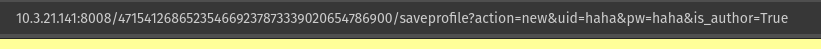

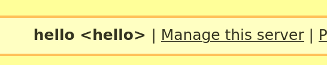

Why this is happening? There is no validation on server and there is a part of code in the tamplate which have `is_admin` which should now be seen by normal user but we could see it. 

Consequences

Unauthorised access to sensitive data can lead to data breaches, financial loss, etc. The risk of broken access control is so high because it directly affects the data on the server. Which includes user data, system data, ect.  

Recommendation

At the basic level, except for public data, the server should have access control. The server should only allow the user to access the data that are meant to be accessed by the user.

Ownership of the data should be maintained. The server should have a proper access control mechanism.

# Hack This Site

## Basic 

### Level 1(the idiot test)

I viewed the source code of the page and found the password in the comments.

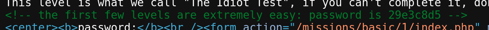

### Level 2(what's the password)

This level was an accident for me. I was about to find the password in the source code but I accidentally clicked on the submit button and it took me to the next level.

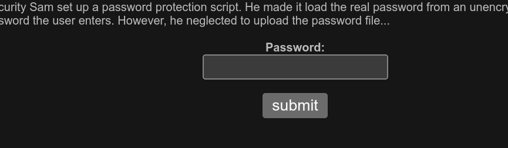

### Level 3(what's the password)

I viewed the source code of the page and there was hidden file named `password.php` which contained the password.

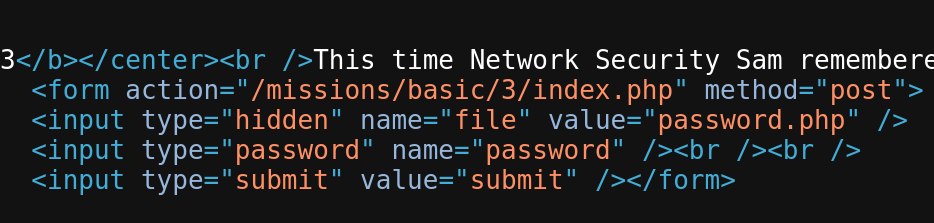

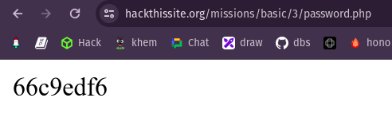

### Level

It says that it automatically sends the password to sam when we click the `send password to sam` button. May be I can send that password to my email. lets do it.

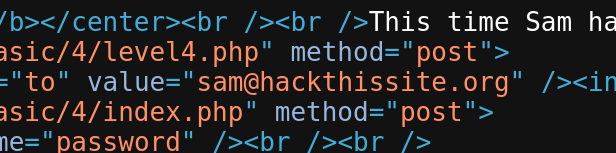

I found the email where the password was sent.

I changed the email to my email and clicked the `send password to sam` button.

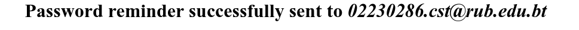

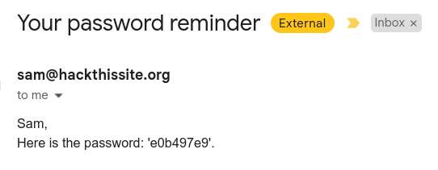

I received the password in my email.

### Level 5

Now I have to use burp suite to intercept the request and change whatever I can to get the password.

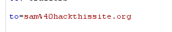

I changed the recipient to my email and sent the request.

I got password in my email.

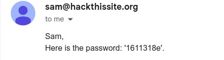

