## Execute Summary

This is a writeup about the machine "START UP". This machine is rated as easy. This machine is about finding hidden directories, analyzing pcapng file using wireshark, exploiting ftp and getting root access.

Target: 10.10.74.218

## Information Gathering Phase

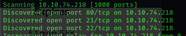

Discovered 3 ports open.

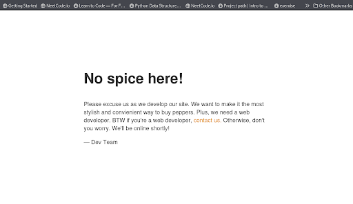

Since port 80 is open, lets check it out hidden directories.

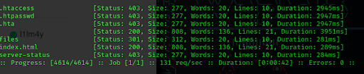

I found a hidden directory. Lets check it out.

Wait!! Port 21 is open and lets check out whether we can login to ftp.

## Exploitation Phase

I am successfully logged in anoymously.  So I tried to upload revese shell file to get higher privilages and I was successful.

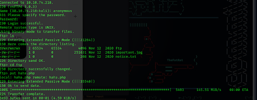

So lets execute the reverse shell file from searching from hidden directories.

I got the file that I uploaded from ftp in the hidden directory. Lets execute it.

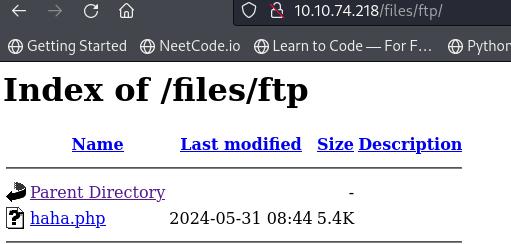

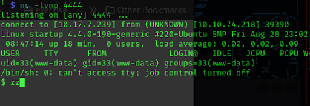

Now I got a reverse shell so lets upgrade it.

    python3 -c 'import pty; pty.spawn("/bin/bash")'

After sneaking around I found the user called lennie and we don't have permission to get in.

In one of the directory called incident, there was a file `suspicious.pcapng` which I downloaded and checked it out. 

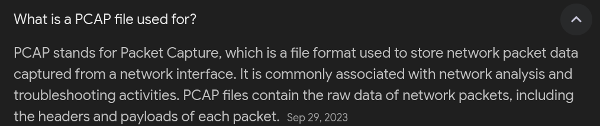

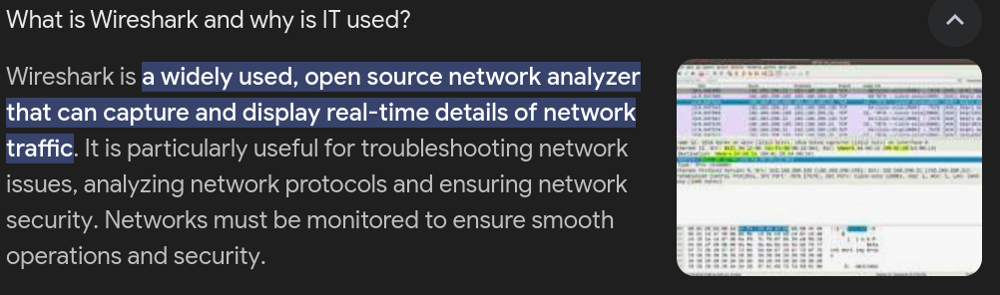

There is a relationship between suspicous.pcapng and wireshare. Lets check it out.

I found a passowrd for lennie after analyzing the pcapng file using wireshark.

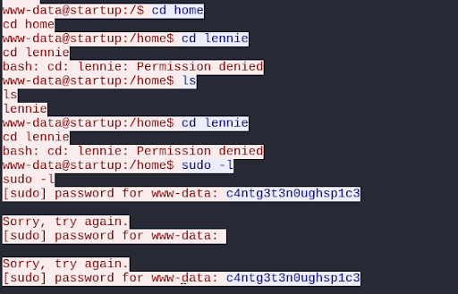

So lets login to lennie using the password.

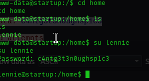

I found a user.txt.

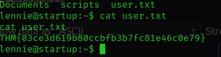

Now there are two differnt directories. One is Document and other is scripts. Lets check it out.

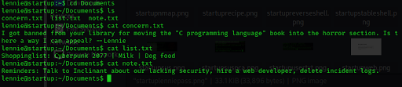

I didn't find anything useful in the document directory. So lets check out the scripts directory.

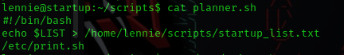

This script echoes a variable into the startup_list.txt file. Then it executes another script called print.sh, let’s see what’s in there.

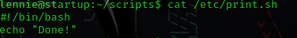

Ahh I see, it echoes "Done!". May be we can echo something else to check whether it works or not.

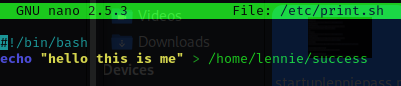

I echoed "success" lets check whether it worked or not.

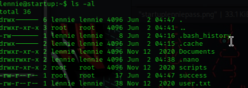

It worked. That means the script is run by root everytime the machine starts. So lets try to get root access.

So we edit print.sh script to get root shell instead.

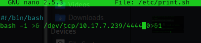

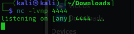

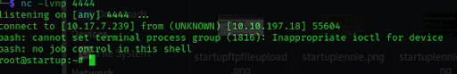

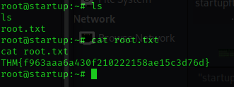

### Final Thoughts

This was a fun machine. This machine introduced me to new security tool called `wireshark`. And learned how to analyze pcapng file using wireshark. 

