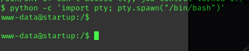
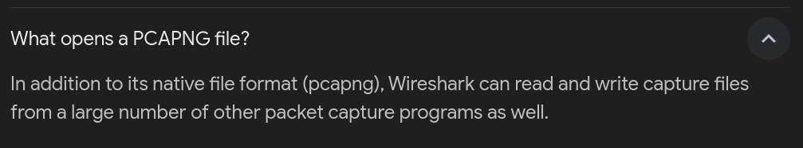

## Execute Summary

Target: 

## Information Gathering Phase

Discovered 3 ports open.

Since port 80 is open, lets check it out hidden directories.

I found a hidden directory. Lets check it out.

Wait!! Port 21 is open and lets check out whether we can login to ftp.

## Exploitation Phase

I am successfully logged in anoymously.  So I tried to upload revese shell file to get higher privilages and I was successful.

So lets execute the reverse shell file from searching from hidden directories.

I got the file that I uploaded from ftp in the hidden directory. Lets execute it.

Now I got a reverse shell so lets upgrade it.

    python3 -c 'import pty; pty.spawn("/bin/bash")'

After sneaking around I found the user called lennie and we don't have permission to get in.

In one of the directory called incident, there was a file `suspicious.pcapng` which I downloaded and checked it out. 

There is a relationship between suspicous.pcapng and wireshare. Lets check it out.

I found a passowrd for lennie after analyzing the pcapng file using wireshark.

So lets login to lennie using the password.

I found a user.txt.

Comming soon...
