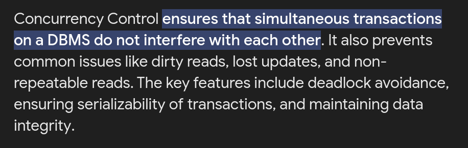
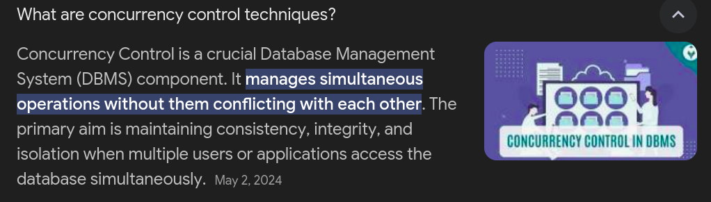
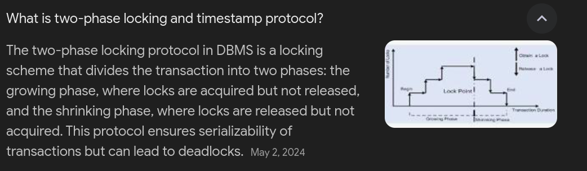
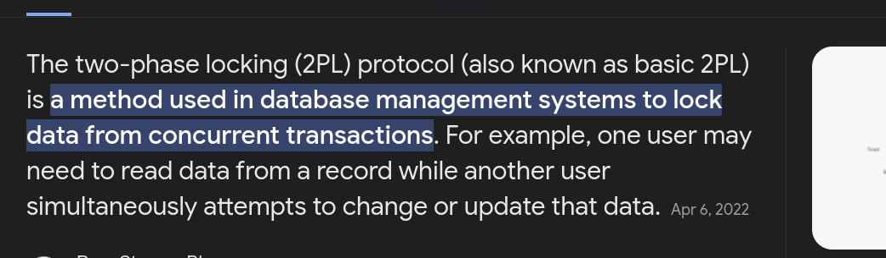
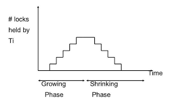
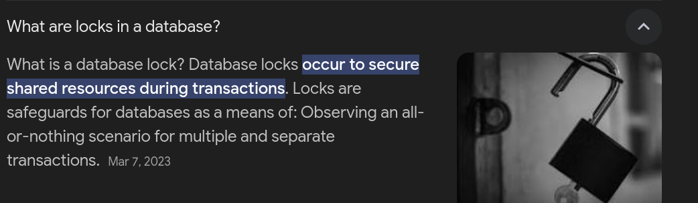

# Concurrency Control

It manages how multiple users or processes interact with the database at the same time. Its primary aim is to keep the database consistent, accurate, and isolated during simultaneous access.

It also solves the problem when two person is booking ticket for their flight/ride at the same time for last seat, it ensures that the ticket is booked for only one person and not for both.

## Concurrency Control Techniques

The prominent concurrency control techniques are the Two-Phase Locking (2PL) Protocol and the Timestamp Ordering Protocol.

1. Two-Phase Locking Protocol

Phase

Growing Phase: Here, a transaction can take as many locks as it needs without being able to let go of any. This stage lasts until the transaction has all the locks it wants and stops asking for more.

Shrinking Phase: In this stage, a transaction can release locks but cannot acquire any new ones. This stage lasts until the transaction releases all its locks.

Lock Point: The specific instant when a transaction shifts from the Growing Phase to the Shrinking Phase, marked by releasing its first lock, is called the lock point.

1. Timestamp Ordering Protocol

The Timestamp Ordering Protocol is a method for managing concurrency in databases that keeps transactions in order using timestamps instead of locks. It ensures that transactions happen in a way that maintains their original sequence, based on when they start.

Read Timestamp (RTS): This is the latest timestamp associated with a transaction that has accessed a particular piece of data.

Write Timestamp (WTS): This refers to the latest timestamp linked to a transaction that has modified a specific piece of data.

## What Are Locks?

* Shared Locks: These locks are used when a transaction wants to read data. They allow multiple transactions to read the same data simultaneously.

* Exclusive Locks: These locks are used when a transaction wants to write data. They prevent other transactions from reading or writing the same data.

## What Are Latches?

Latches are lightweight locks that are used to protect shared data structures in a multi-threaded environment. They are used to ensure that only one thread can access a shared data structure at a time.

* Shared Latches: These latches are used when multiple threads want to read the same data structure. They allow multiple threads to read the data structure simultaneously.

* Exclusive Latches: These latches are used when a thread wants to write to a data structure. They prevent other threads from reading or writing the data structure.

### Conclusion

In the article, I learned that a system for handling multiple tasks at the same time is crucial for a database management system (DBMS). This system makes sure that many tasks can run together without causing problems. The main ways to do this are by using locks, timestamps, and a method called optimistic concurrency control.

We also talked about the difference between locks and latches. Locks are used to keep data safe and separate between different tasks, while latches are used to make sure that the inner parts of the DBMS aren't changed by too many threads at once.

