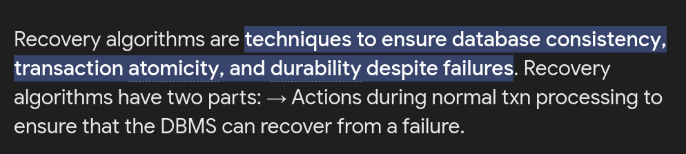
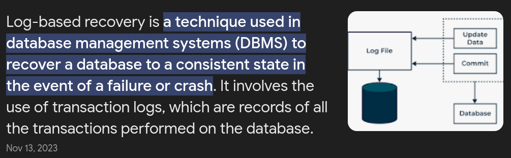
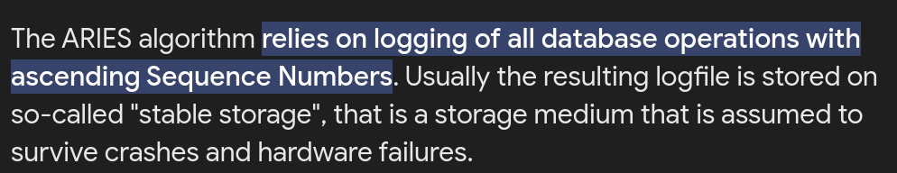
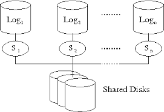
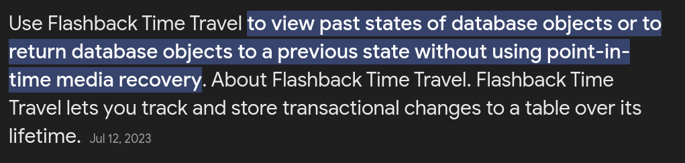
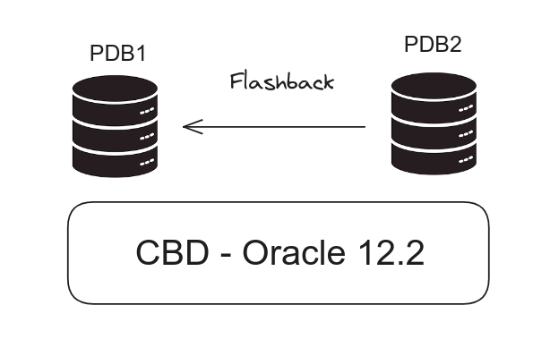

# Recovery Algorithm

## Log-Based Recovery

Log-based recovery in DBMS is a method that helps keep a database safe after something goes wrong, like a computer crashing. It does this by keeping a record of everything that happens in the database, like adding, changing, or deleting information. If something bad happens, like a crash, the DBMS looks at these records to figure out what needs to be fixed. It might need to redo some things that didn't get finished or undo things that were started but not finished. This way, the database can go back to working normally again.

## ARIES (Algorithms for Recovery and Isolation Exploiting Semantics)

### How it works?

*  Analysis: Identifies the starting point for recovery and creates a snapshot of the database's state at the crash.

* Redo: Reapplies updates from the log to ensure all changes intended to be permanent are applied.

* Undo: Undoes changes made by incomplete transactions to return the database to a consistent state.

## Time Travel Recovery (Flashback Technology)

### How does it works.

* Tracks Changes: Automatically saves historical versions of changes to tables, allowing you to access past states of data.

* Enables Compliance: Useful for meeting record retention policies and generating audit reports.

* Restores Data: Can revert tables to a previous state, useful for correcting errors or recovering from mistakes.

* Adjusts Retention: Lets you decide how long to keep historical data, helping manage storage.

* Manages Storage: Provides options to delete old data, freeing up space.

