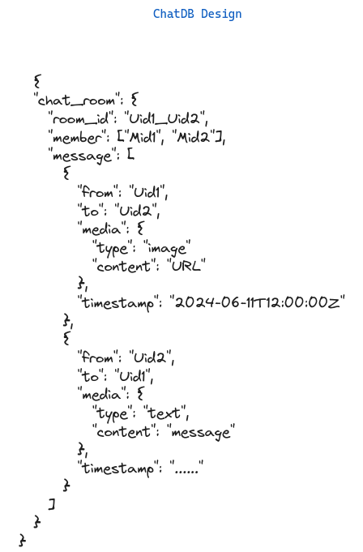
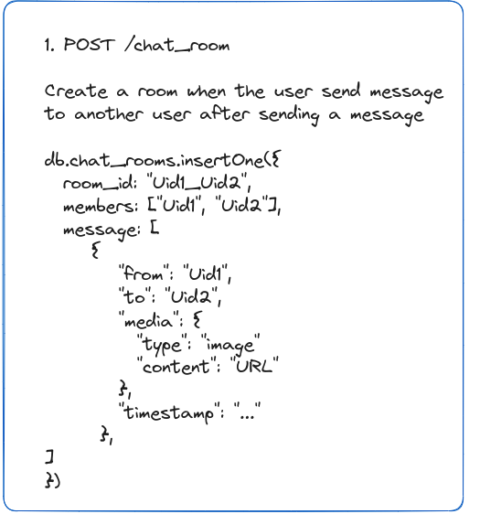

# Report

Welcome to our final assignment where we will create our own tellonym. This is the big moment where we put all our learning into action. With 8 of us working together we are going to make a cool version of Tellonym. This project is all about showing off what we have learn till now in software engineering course. 

Soo lets get started.

## Day 01 (Schema Design)

On the first day of the project, we taked about what needed to be done, who was going to do what, and divided work among ourselves. 

FIrst of all we focus on creating database schema for the application. There were two database to be made, one for chat application which uses nosql(mongodb) and other one is for overall functionality. Me and two other friends focus on chat application database schema where we have to design how messages are stored in the database. 

This is what we have design for storing messages.

After designing above schema design we designed possible endpoints for the design.

