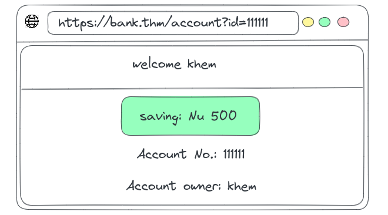
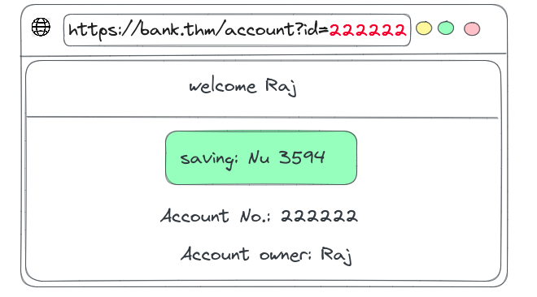
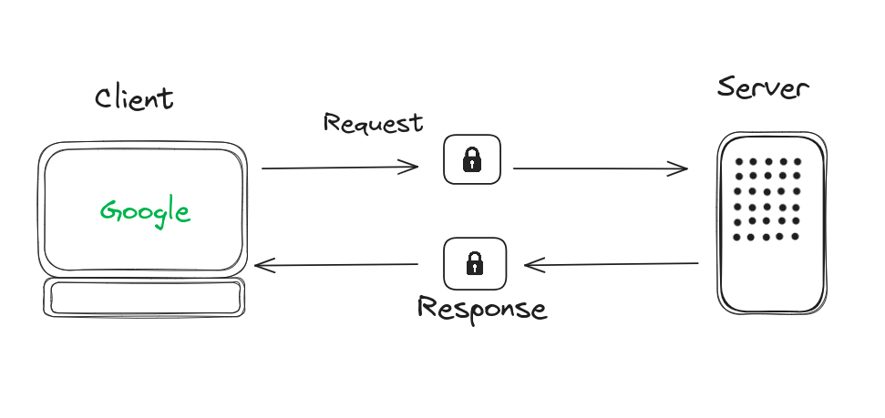
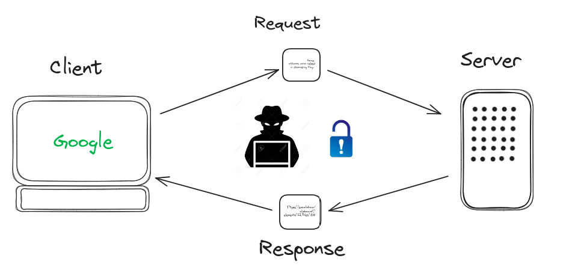
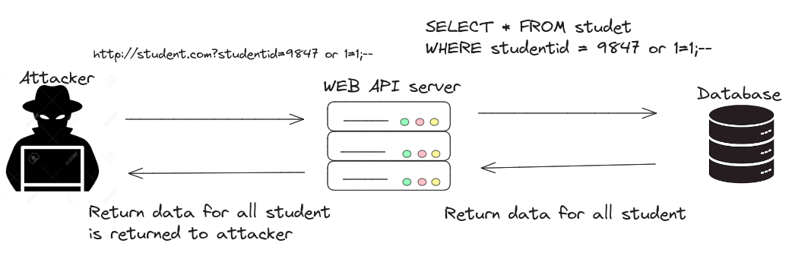
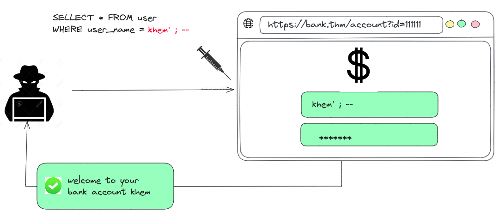
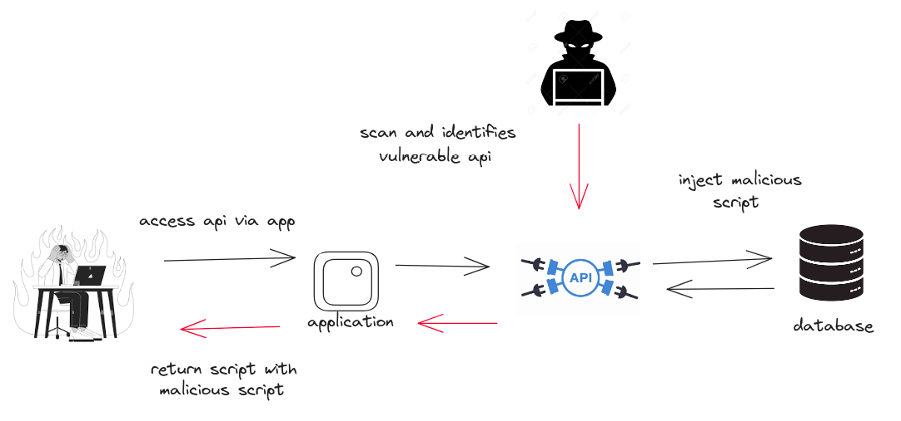
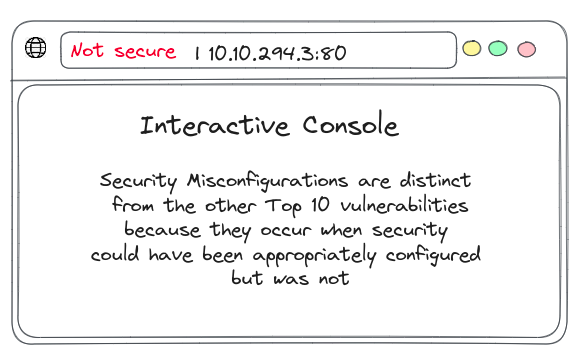
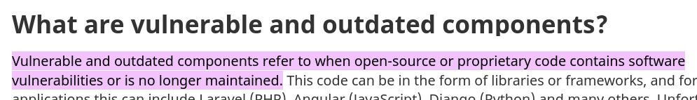
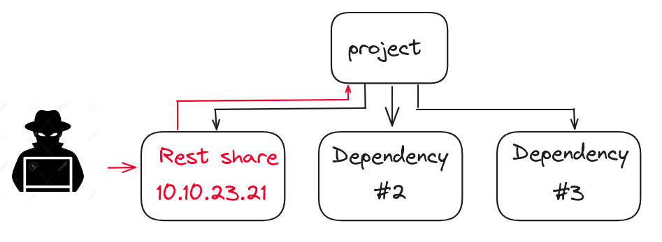

### 1. Broken Access Control

Only the site's admin user are able to access the procted page, if normal user are able to access them then access controls are broken. 

If access control are broken:
* normal user will be able to view sensitive data.
* Unthorized access control.

Unthorized access control

This occurs when an application provides direct access to objects based on user-supplied input. As a result attacker and  bypass authorization and access sensitive data.

### 2. Cryptographic Failures

Cryptographic Failures arises from misuse (or lack of use) of cryptographic algorithms for protecting sensitive information.

Communication between server and client should be encrypted so that no one can see the conversation between server and client.

Communications between server and client are encrypted.

 Cryptographic Failures

### 3. Injection

SQL injection occurs when attacker inserts malicious SQL code into query, which have potential to manipulate the database and  can access the sensitive information.

Command injection happens when a application doesn't take the user input to system shell without sanitizing. Attacker can just issue command and do what ever they want as if they are sitting infront of server.

### 4. Insecure Design

Its a application that is build without thinking about the security. So there could be weak points for attacker to get unauthorized access.

### 5. Security Misconfiguration

Security Misconfiguration happens when the system are not setup correctly which creates vulnerabilities that can be exploited by attacker.

Security Misconfiguration can leads to unauthorized access to sensitive data. 

Security misconfigurations include:

* Default accounts with unchanged passwords.
* enabling unnecessary feature on.
* Not using HTTP security headers.

### 6. Vulnerable and Outdated Components

Coming soon..

